# Rlink Tracker 🛰️

**Rlink Tracker** es una plataforma web integral diseñada para el seguimiento (tracking) de vehículos en tiempo real, gestión de geocercas y análisis de seguridad. Es una solución robusta, extensible y adaptable a diversos flujos de trabajo logísticos y preventivos.

## Tecnologías

El proyecto utiliza un stack moderno enfocado en la alta disponibilidad y el procesamiento de datos geográficos:

* **Backend:** Ruby on Rails
* **Frontend:** JavaScript, HTML5, Bootstrap, SCSS
* **Base de Datos:** PostgreSQL
* **IA:** Chatbot integrado basado en Intent-Based LLM

## Funcionalidades Principales

### 1. Monitoreo en Tiempo Real

Visualización centralizada de toda la flota sobre mapas interactivos (Calles o Satélite).

* **Panel Lateral Inteligente:** Acceso rápido a filtros por estado, grupo, geocercas y recorridos sin salir de la vista principal.
* **Búsqueda Global:** Localización instantánea de dispositivos por nombre o patente.
* **Indicadores Visuales:** Iconografía diferenciada para identificar rápidamente el tipo de vehículo y su estado actual en el mapa.

### 2. Consultas sobre vehiculos

El ususario pude consultar mediante un menu recorridos por uno o varios vehiculo en periodos de tiempo especifico asi como tambien en zonas dibujadas o geocercas(formas con lat y long guardadas por el usuario)

#### 2.1 Menu de consultas pop up

Con este menu el usuario accede a los distintos filtros y funcionalidades de busqueda

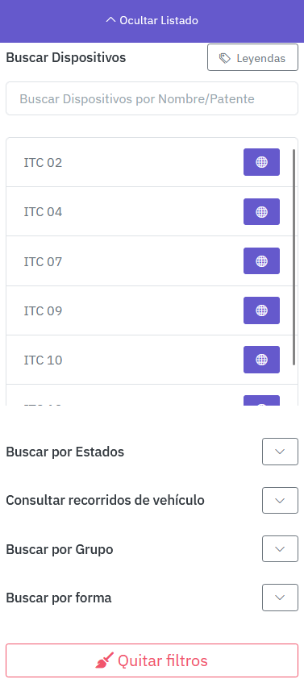

#### 2.1 Barra de busqueda y seleccion de dispositivos

La barra de busqueda filtra dispositivos y estos pueden ser seleccionados para ser los unicos visibles en el mapa

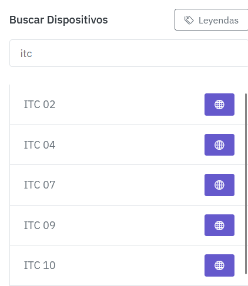

#### 2.2 Filtro por estados

Dependiendo del swich activado los dispositivos mostrados se filtran para su mas facil monitoreo

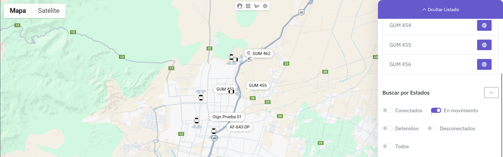

#### 2.3 Consulta de recorridos de vehículos

Esta funcionalidad permite al cliente Bucar los recorridos hechos por vehículos en periodos de tiempo determinados por ellos

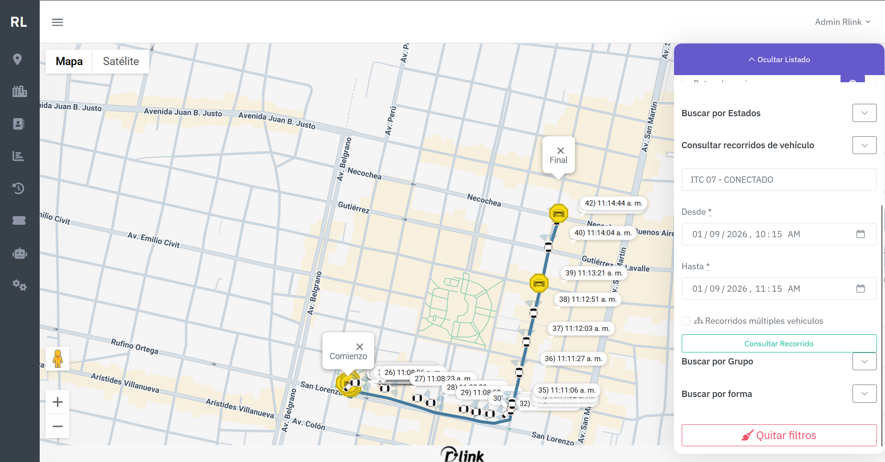

#### 2.4 Consulta Usando formas

Esta funcionalidad permite consultar los vehículos que se encontraban en cierta posición en cierto periodo de tiempo, esto se puede consultar dibujando una forma en el momento o usando una geocerca ya guardada por el usuario

#### 2.4.1 Consulta Usando formas - con geocerca guardada

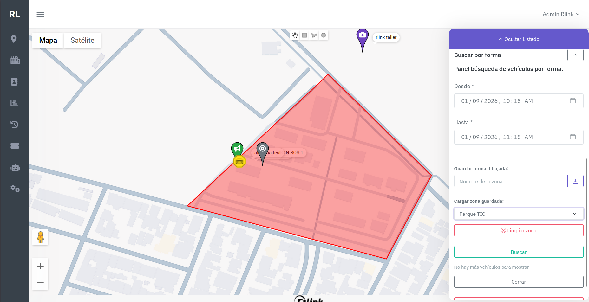

#### 2.4.1 Consulta Usando formas - dibujando una forma nueva

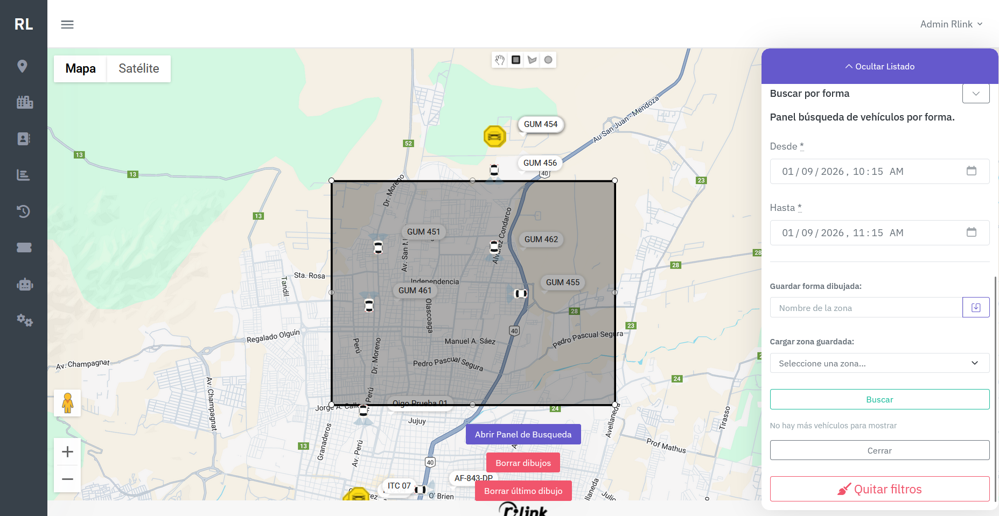

### 3. Reporte de Activos y Seguridad

Un módulo administrativo completo para organizar los y visualizar la información reportada al sistema:

* **Vehículos y Contactos:** Registro y control de unidades y personal asignado.
* **Dispositivos de Emergencia:** Gestión dedicada para Botones de Pánico y Botones SOS.
* **Monitoreo Visual:** Integración de cámaras para verificación en vivo.
* **Alertas:** Configuración de Alarmas y Alarmas Comunitarias para respuesta rápida ante incidentes.

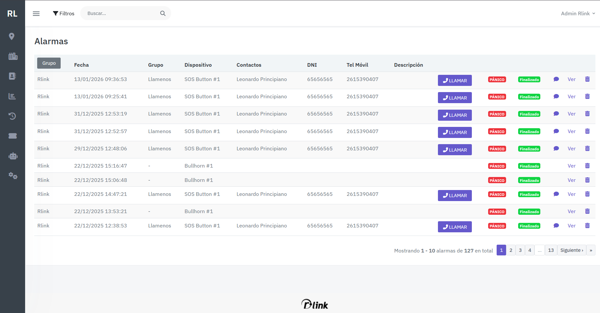

### 4. Menus/leftside

Los distintos dispositivos y funcionalidades de la pagina son accedidos a travez de un sidebar cuyos iconos y se mostraran dinámicamente dependiendo de los permisos del usuario usando la apicación

#### 4.1 Vista admin

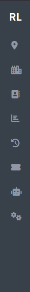
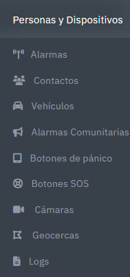

#### 4.2 Vista cliente

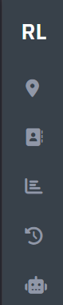
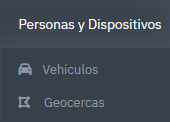

### 5. Geocercas y Análisis Espacial

Herramientas avanzadas para el control perimetral.

* **Dibujo Dinámico:** Creación de zonas (polígonos, círculos o rectángulos) directamente sobre el mapa.
* **Auditoría Histórica:** Consultas para determinar qué vehículos ingresaron o salieron de una geocerca en rangos de tiempo específicos.

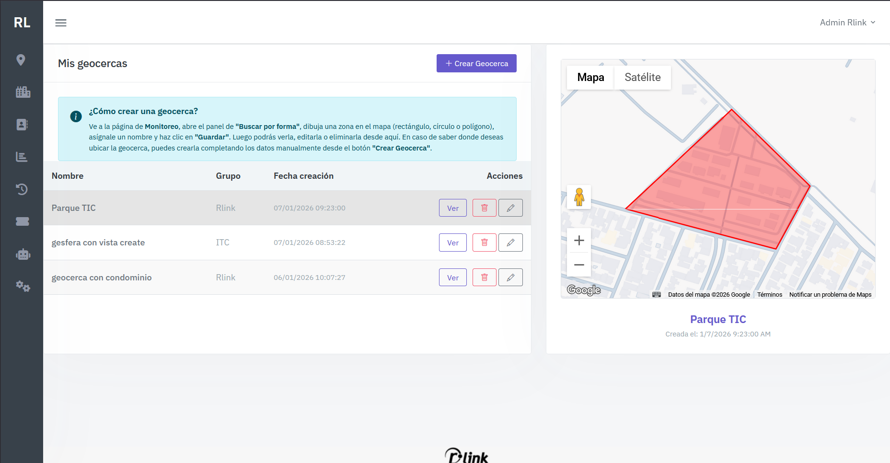

### 6. Reportes y Recorridos

* **Historial de Rutas:** Reconstrucción del camino seguido por cualquier unidad con marcas de tiempo exactas.
* **Exportación de Datos:** Generación de reportes detallados en Excel para auditorías logísticas.
* **Logs del Sistema:** Registro completo de eventos para trazabilidad administrativa.

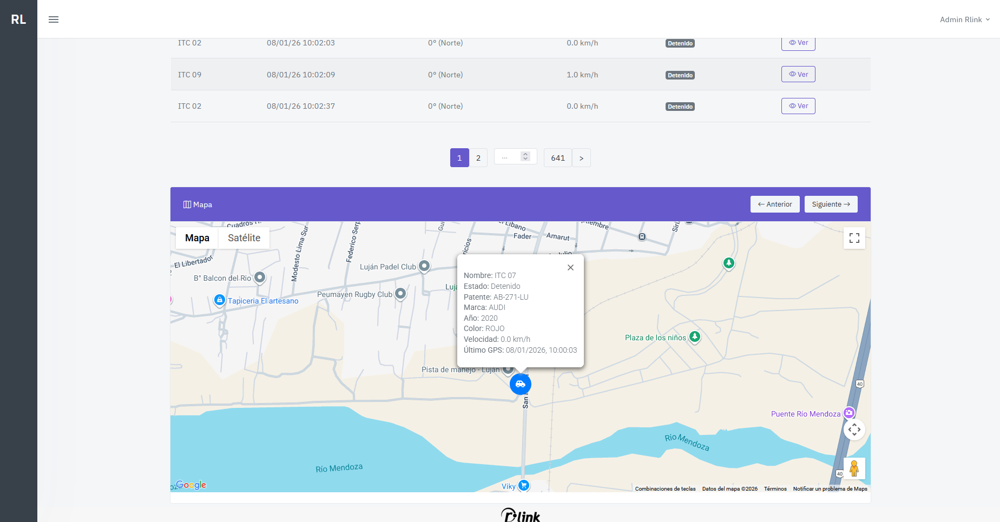

### 7. Chatbot con IA (Intent-Based)

Interacción fluida mediante lenguaje natural. El sistema entiende intenciones del usuario para buscar autos, usuarios o alarmas sin necesidad de navegar manualmente por las tablas de datos.

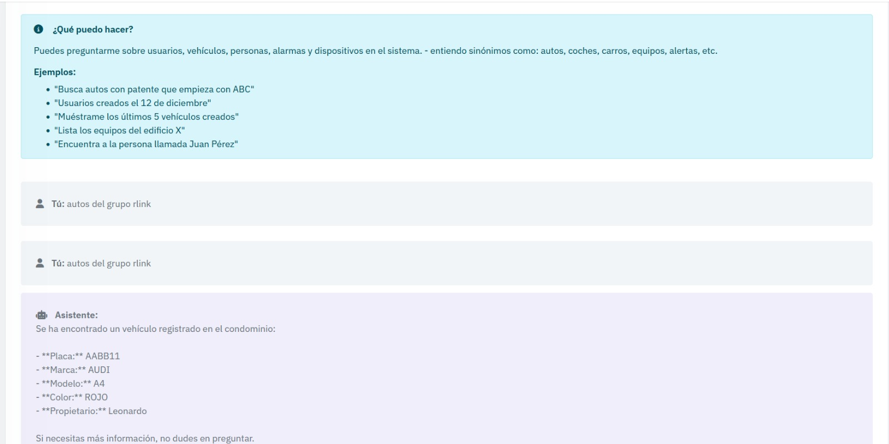

## Licencia

Este proyecto está bajo la licencia [RLINK] la distribucicion de codigo no esta permitida esta es una exposcion de funcionalidades por uno de sus desarrolladores.