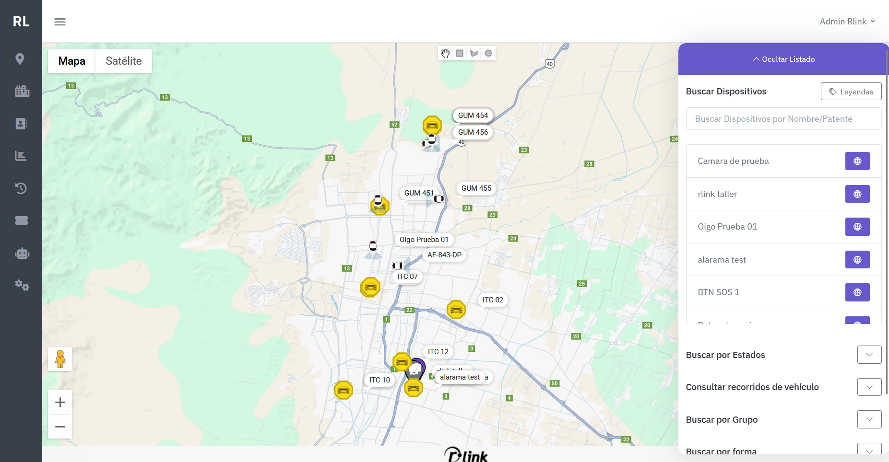

# Rlink Tracker 🛰️

**Rlink Tracker** es una plataforma web integral diseñada para el seguimiento (tracking) de vehículos en tiempo real, gestión de geocercas y análisis de seguridad. Es una solución robusta, extensible y adaptable a diversos flujos de trabajo logísticos y preventivos.

## 🚀 Tecnologías

El proyecto utiliza un stack moderno enfocado en la alta disponibilidad y el procesamiento de datos geográficos:

* **Backend:** Ruby on Rails
* **Frontend:** JavaScript, HTML5, Bootstrap, SCSS
* **Base de Datos:** PostgreSQL
* **IA:** Chatbot integrado basado en Intent-Based LLM

---

## ✨ Funcionalidades Principales

### 1. Monitoreo en Tiempo Real

Visualización centralizada de toda la flota sobre mapas interactivos (Calles o Satélite).

* **Panel Lateral Inteligente:** Acceso rápido a filtros por estado, grupo, geocercas y recorridos sin salir de la vista principal.
* **Búsqueda Global:** Localización instantánea de dispositivos por nombre o patente.
* **Indicadores Visuales:** Iconografía diferenciada para identificar rápidamente el tipo de vehículo y su estado actual en el mapa.

### 2. Gestión de Activos y Seguridad

Un módulo administrativo completo para organizar los recursos del sistema:

* **Vehículos y Contactos:** Registro y control de unidades y personal asignado.
* **Dispositivos de Emergencia:** Gestión dedicada para Botones de Pánico y Botones SOS.
* **Monitoreo Visual:** Integración de cámaras para verificación en vivo.
* **Alertas:** Configuración de Alarmas y Alarmas Comunitarias para respuesta rápida ante incidentes.

### 3. Geocercas y Análisis Espacial

Herramientas avanzadas para el control perimetral.

* **Dibujo Dinámico:** Creación de zonas (polígonos, círculos o rectángulos) directamente sobre el mapa.
* **Auditoría Histórica:** Consultas para determinar qué vehículos ingresaron o salieron de una geocerca en rangos de tiempo específicos.

### 4. Reportes y Recorridos

* **Historial de Rutas:** Reconstrucción del camino seguido por cualquier unidad con marcas de tiempo exactas.
* **Exportación de Datos:** Generación de reportes detallados en Excel para auditorías logísticas.
* **Logs del Sistema:** Registro completo de eventos para trazabilidad administrativa.

### 5. Chatbot con IA (Intent-Based)

Interacción fluida mediante lenguaje natural. El sistema entiende intenciones del usuario para buscar autos, usuarios o alarmas sin necesidad de navegar manualmente por las tablas de datos.

---

## 📄 Licencia

Este proyecto está bajo la licencia [RLINK] la distribucicion de codigo no esta permitida esta es una exposcion de funcionalidades por uno de sus desarrolladores.

---

¿Te gustaría que añada alguna sección específica sobre la arquitectura del backend en Rails o sobre cómo configurar el entorno de desarrollo?